# Project Goal

This project reproduces an R-based CO2 emissions analysis in Python.

The goal is to create a reproducible workflow that downloads the Our World in Data CO2 dataset, cleans the data, generates visualizations, runs a regression analysis, and produces a final report.

# Dataset

The project uses the Our World in Data CO2 dataset.

The dataset includes information about:

- CO2 emissions
- CO2 emissions per capita
- GDP
- Population
- Cumulative CO2 emissions
- Share of global CO2 emissions

# Workflow

The project workflow is:

1. Download the dataset
2. Clean and prepare the data
3. Generate visualizations
4. Run regression analysis
5. Generate the final report

# Visualizations

## 1. Global Average CO2 per Capita Over Time

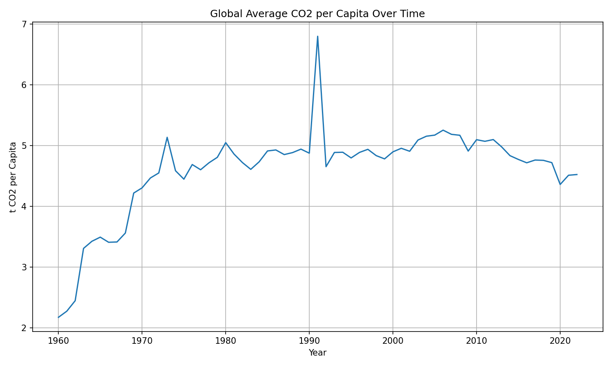

## 2. GDP per Capita vs CO2 per Capita

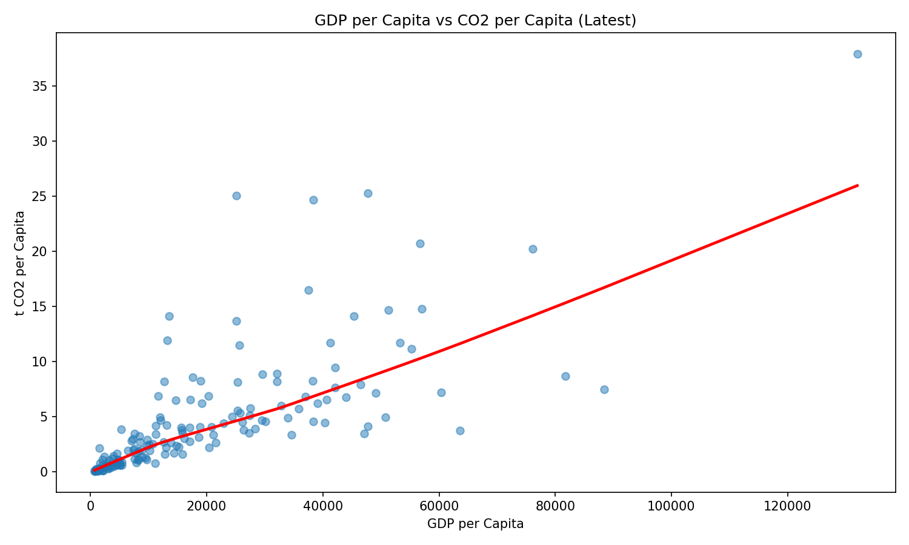

## 3. Linear Regression Plot

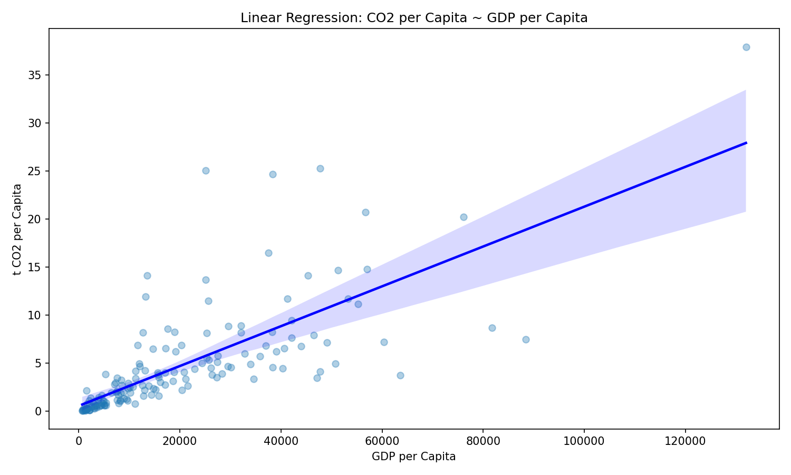

## 4. Top 10 Countries by CO2 per Capita

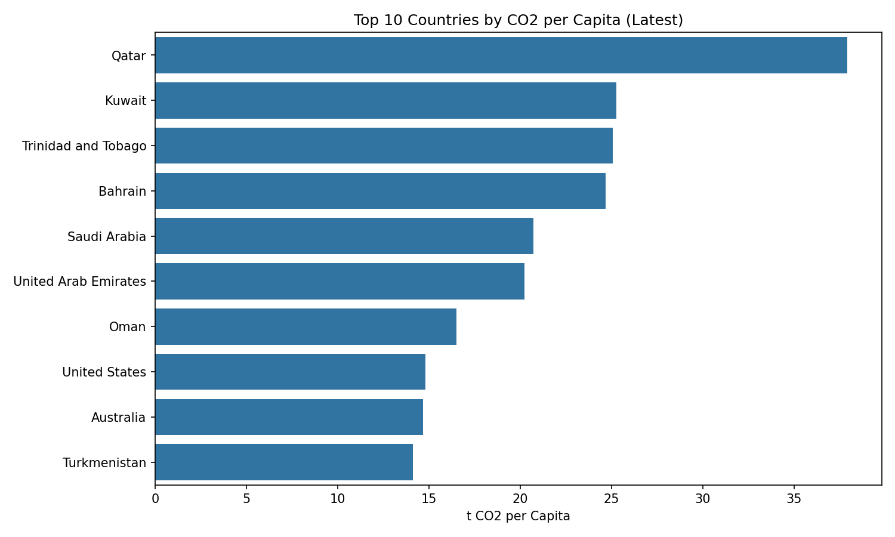

## 5. CO2 per Capita Over Time for Top 5 Countries

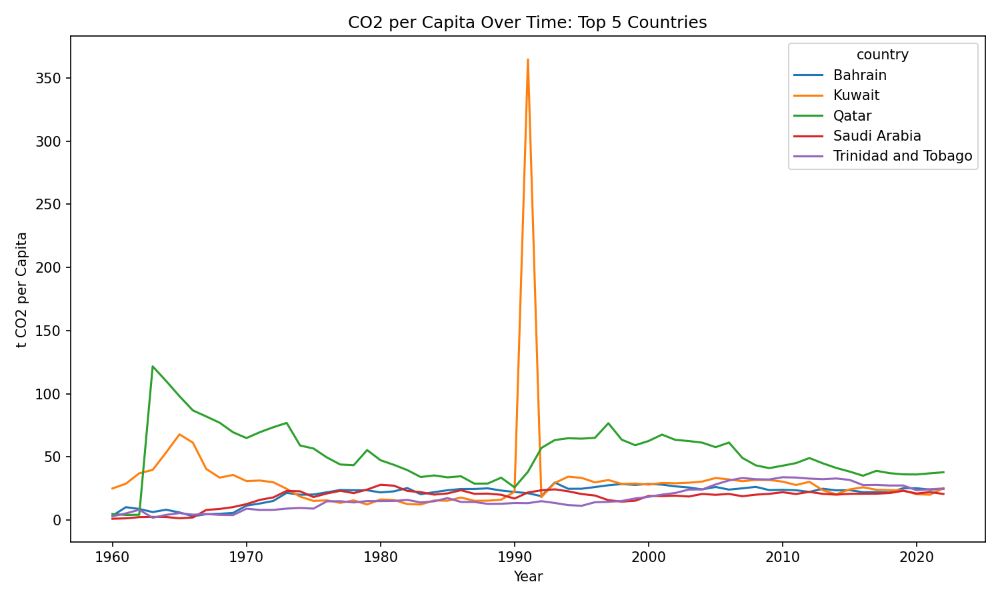

## 6. CO2 per Capita by GDP Quartile Boxplot

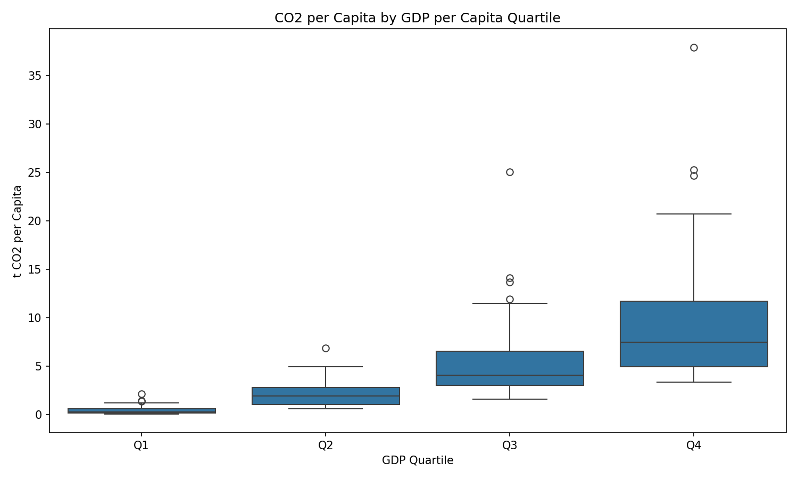

## 7. CO2 per Capita by GDP Quartile Violin Plot

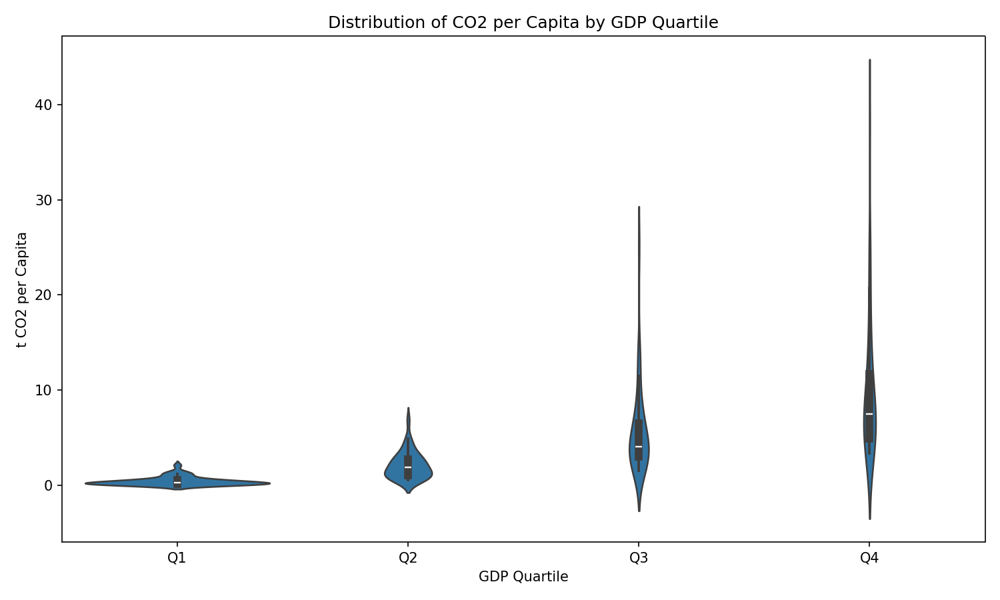

## 8. Heatmap of Average CO2 per Capita by Year and GDP Quartile

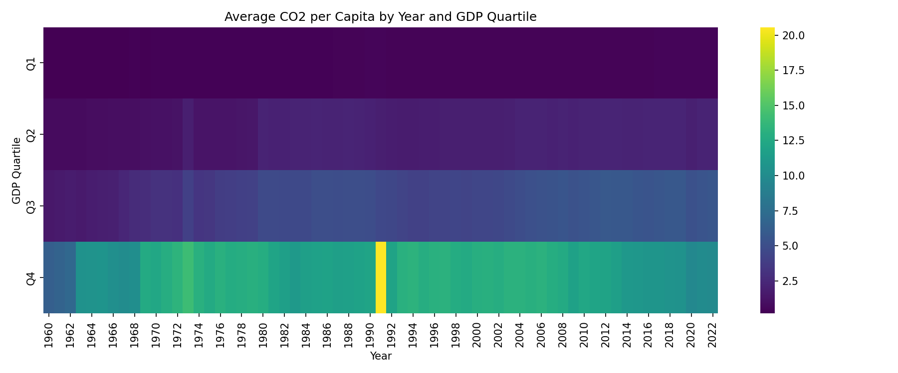

## 9. Cumulative Sum of CO2 per Capita

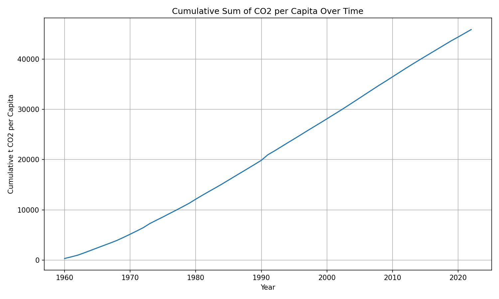

## 10. Year-over-Year Change in Global Average CO2 per Capita

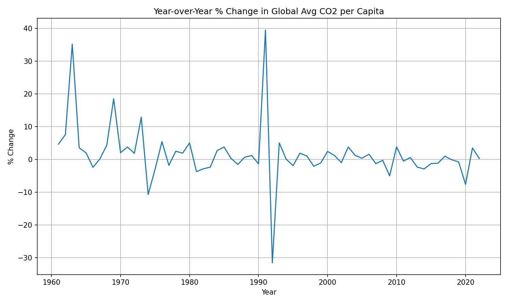

## 11. CO2 per Capita vs Total CO2 Emissions

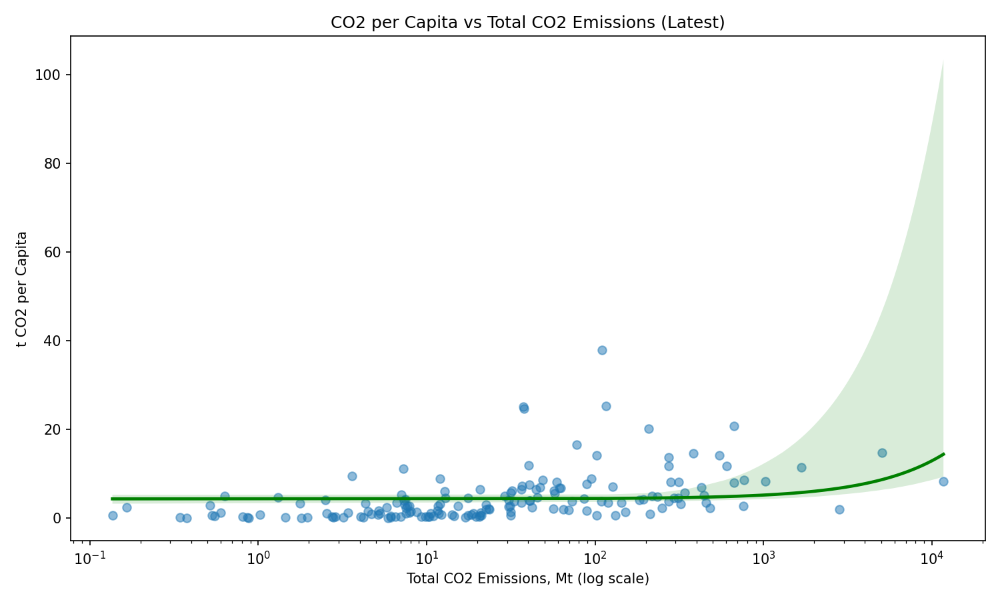

# Regression Analysis

The regression model estimates the relationship between GDP per capita and CO2 emissions per capita.

```text
CO2 per capita ~ GDP per capita
```

The detailed regression output is saved in:

```text
outputs/tables/regression_summary.txt
```

The model achieved an R-squared value of approximately 0.556, indicating a moderate positive relationship between GDP per capita and CO2 emissions per capita.

# Conclusion

This project successfully reproduces the main ideas of the original R-based CO2 emissions analysis in Python.

The visualizations show how CO2 emissions per capita differ across countries, GDP groups, and time. The regression analysis demonstrates a positive relationship between GDP per capita and CO2 emissions per capita.

The project is fully reproducible and can be executed locally using:

```bash
make all
```

or inside Docker using:

```bash
docker compose up --build
```

The Docker container automatically downloads the dataset, cleans the data, generates visualizations, runs the regression analysis, and produces the final report.